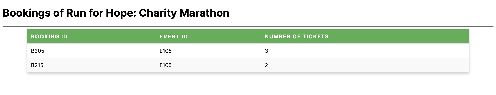

# Final Practical Exam - Event Management Platform

## CMPS 350 Web Development Fundamentals - Spring 2024

### Final Lab Exam

## Instructions

* The exam duration is **120 minutes**.
* **Push your code to GitHub** regularly to avoid any data loss.
* The exam is **open book**. Plagiarism will result in a score of zero for all parties involved.
* Demo your work before leaving the exam.
* Add screenshots of the output to the testing sheet.
* Push your code and testing sheet to your GitHub repo under the Final Exam section.

## Preparation

* Sync cmps350 Lab repo to get the Final Exam Files.
* Download the **Final Exam Folder** from GitHub and move it to your repository.
* Open the **Event Management Platform-base code** project and Run **npm install** to get all dependencies.
* Create the .env file.
* Make sure you have the **Prisma** extension in your VS Code for Prisma code highlighting.
* Add “**type**: “module” into your **package.json** file.
* After migrating your project, remove the “**type: module**” to ensure your project runs with **npm run dev**.

## Event Management App

In this Exam, you will demonstrate your ability in front-end and back-end web development by creating a web application for event management. The application will be built using Next.js, React, and Prisma. It will allow users to manage events, bookings, and attendee information.

## Creating the Server and Event APIs (70%)

### Models [10%]

* **Event and Booking Models**: Create models with properties and validations. All fields are required, with validations for event dates and booking capacities defined.
  
  *Figure 1: Event Booking Entity Relationship Diagram*
* **Some helpfull commands***

  * `npx prisma generate // Generate Prisma client for database access`
  * `npx prisma migrate dev --name init // Apply initial database schema migration `
  * `npx prisma studio // To view and interact with the database visually `

### Repository [25%]

* **EventRepo Class**: Implement methods to interact with the database collections (events and bookings).

#### Methods

```
getEvents()         		// Return all events
addEvent(event)        		// Add a new event
deleteEvent(id)        		// Remove an event
updateEvent(id, event) 		// Update an event
getEventBookings(id)   		// Return all bookings for a given event
addBooking(booking)    		// Add a new booking
deleteBooking(id)      		// Delete a booking
getBooking(id)         		// Get a specific booking
```

### API Handlers/Routes [30]

* **API Routes**: Implement route handlers that use methods from the EventRepo class.

#### Routes

```
GET /api/events                     		// Return all events
POST /api/events                    		// Add a new event
PUT /api/events/:eventId    // Update a event
GET /api/events/:eventId/bookings   		// Get all bookings for an event
DELETE /api/bookings/:bookingId     		// Delete a specific booking
```

## Implementation of the User Interface (40%)

1. [15 pts] Create Event List Page: Retrieve and display all events and their bookings as shown in the accompanying figures.
   
   *Figure 2 : Home Events Page*
2. [10 pts] Update Event: Implement an "Update Event" feature that allows users to update existing event. Once the user clicks on the Update Event button you should navigate them to `/events/{eventId}/edit ` page which renders the form shown in figure 3. Once the user updates the event you should navigate them back to the home page `/`
   
   *Figure 3: Update Event Page*
3. [5 pts] View Bookings: When the user clicks on the View Bookings Link, you should render all the bookings of the selected event under  `/events/{eventId}/bookings`
   
   *Figure 4: Bookingss of selected event*
